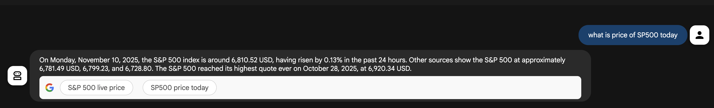

# ADK Built-in Tool - Google Search

A simple ADK agent that demonstrates using the built-in Google Search tool to answer questions using real-time web search.

## Overview

This agent uses the `google_search` built-in tool from ADK to search the web and provide up-to-date information.

## Project Structure

```
adk_builtin_tool_agent/
├── agent.py         # Main agent code with google_search tool
├── __init__.py      # Package initialization
└── .env.example     # Example environment variables template
```

## Prerequisites

- Python 3.11 or later
- Google ADK installed (see parent directory README for installation instructions)
- Google API key from [Google AI Studio](https://aistudio.google.com/apikey)

## Setup

1. Create a `.env` file with your API key and configuration:

Copy the example environment file and update it with your API key:

```bash
cp .env.example .env
```

Then edit `.env` and replace `"your-api-key"` (or `"YOUR_API_KEY"`) with your actual Google API key.

**Environment Variables:**
- `GOOGLE_GENAI_USE_VERTEXAI=False`: Use AI Studio (Gemini API) instead of Vertex AI
- `GOOGLE_API_KEY`: Your Google API key from [Google AI Studio](https://aistudio.google.com/apikey)

## Usage

### Run with Command Line Interface

From the `1_adk_tools` directory:

```bash
adk run adk_builtin_tool_agent
```

### Run with Web Interface

From the `1_adk_tools` directory:

```bash
adk web
```

Then open the URL shown in the terminal (typically `http://localhost:8000`) in your browser and select the agent.

## Agent Details

- **Google ADK Version**: `1.18.0`
- **Model**: `gemini-2.5-flash`
- **Tool**: `google_search` (built-in ADK tool)
- **Capabilities**: Searches the web to answer questions with current information

## Demo



## References

- [ADK Documentation](https://google.github.io/adk-docs/)
- [Built-in Tools](https://google.github.io/adk-docs/tools/built-in-tools/)
- [Python Quickstart](https://google.github.io/adk-docs/get-started/python/)

