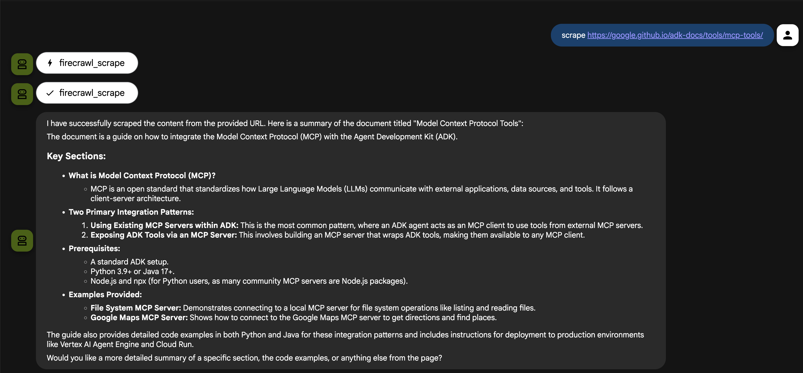

# ADK MCP Tool - Firecrawl

An ADK agent that uses MCP (Model Context Protocol) tools to interact with Firecrawl for web scraping and crawling capabilities.

## Overview

This agent demonstrates how to use MCP toolsets to connect to Firecrawl, enabling web scraping, content extraction, and website crawling functionality.

## Project Structure

```
adk_mcp_firecrawl_agent/
├── agent.py         # Main agent code with MCPToolset
├── __init__.py      # Package initialization
└── .env.example     # Example environment variables template
```

## Prerequisites

- Python 3.11 or later
- Google ADK installed (see parent directory README for installation instructions)
- Google API key from [Google AI Studio](https://aistudio.google.com/apikey)
- Firecrawl API key from [Firecrawl](https://firecrawl.dev/)
- Node.js and npx (for Firecrawl MCP, automatically installed when agent runs)

## Setup

### 1. Get Your Firecrawl API Key

To create a Firecrawl API key:

1. Go to [Firecrawl](https://firecrawl.dev/) and sign up for an account
2. Navigate to your [Firecrawl Dashboard](https://dashboard.firecrawl.dev/)
3. Go to **API Keys** section
4. Click **Create API Key** or copy your existing API key
5. **Copy the API key** - you'll need it for the `.env` file

**Note:** Firecrawl offers a free tier with limited requests. Check their [pricing page](https://firecrawl.dev/pricing) for details.

### 2. Create and Configure `.env` File

Copy the example environment file and update it with your API keys:

```bash
cp .env.example .env
```

Then edit `.env` and replace the placeholder values:

```bash
GOOGLE_GENAI_USE_VERTEXAI=False
GOOGLE_API_KEY="your-google-api-key"
FIRECRAWL_API_KEY="your-firecrawl-api-key"
```

**Environment Variables:**
- `GOOGLE_GENAI_USE_VERTEXAI=False`: Use AI Studio (Gemini API) instead of Vertex AI
- `GOOGLE_API_KEY`: Your Google API key from [Google AI Studio](https://aistudio.google.com/apikey)
- `FIRECRAWL_API_KEY`: Your Firecrawl API key (created in step 1 above)

**Note:** The agent uses `npx firecrawl-mcp` which will be automatically installed when the agent runs.

## Usage

### Run with Command Line Interface

From the `2_adk_mcp` directory:

```bash
adk run adk_mcp_firecrawl_agent
```

### Run with Web Interface

From the `2_adk_mcp` directory:

```bash
adk web
```

Then open the URL shown in the terminal (typically `http://localhost:8000`) in your browser and select the agent.

## Agent Details

- **Google ADK Version**: `1.18.0`
- **Model**: `gemini-2.5-pro`
- **Tool**: `MCPToolset` connected to Firecrawl MCP
- **Capabilities**: 
  - Web scraping
  - Content extraction
  - Website crawling
  - URL content retrieval

## Configuration

The agent connects to Firecrawl via:
- **Connection Type**: Stdio (standard input/output)
- **Command**: `npx -y firecrawl-mcp`
- **Authentication**: API key from `FIRECRAWL_API_KEY` environment variable
- **Timeout**: 30 seconds

## Demo



## References

- [ADK Documentation](https://google.github.io/adk-docs/)
- [MCP Tools](https://google.github.io/adk-docs/tools/mcp-tools/)
- [Firecrawl Documentation](https://docs.firecrawl.dev/)
- [Python Quickstart](https://google.github.io/adk-docs/get-started/python/)
