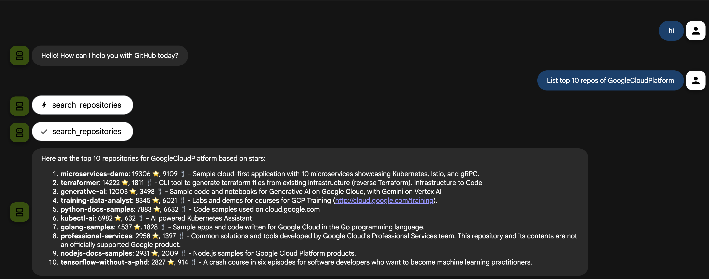

# ADK MCP Tool - GitHub

An ADK agent that uses MCP (Model Context Protocol) tools to interact with GitHub via the GitHub Copilot MCP API.

## Overview

This agent demonstrates how to use MCP toolsets to connect to external services. It uses the GitHub Copilot MCP endpoint to access GitHub information and perform operations.

## Project Structure

```
adk_mcp_github_agent/
├── agent.py         # Main agent code with MCPToolset
├── __init__.py      # Package initialization
└── .env.example     # Example environment variables template
```

## Prerequisites

- Python 3.11 or later
- Google ADK installed (see parent directory README for installation instructions)
- Google API key from [Google AI Studio](https://aistudio.google.com/apikey)
- GitHub Personal Access Token (PAT) with appropriate permissions

## Setup

### 1. Get Your GitHub Token

To create a GitHub Personal Access Token:

1. Go to [GitHub Settings > Developer settings > Personal access tokens > Tokens (classic)](https://github.com/settings/tokens)
2. Click **Generate new token** > **Generate new token (classic)**
3. Give your token a descriptive name (e.g., "ADK MCP Agent")
4. Select the following scopes/permissions:
   - `repo` (Full control of private repositories) - for accessing repositories
   - `read:org` (Read org and team membership) - optional, for organization access
5. Click **Generate token**
6. **Copy the token immediately** - you won't be able to see it again!

**Note:** For read-only operations, you can use a token with minimal permissions. The agent uses read-only mode by default.

### 2. Create and Configure `.env` File

Copy the example environment file and update it with your API keys:

```bash
cp .env.example .env
```

Then edit `.env` and replace the placeholder values:

```bash
GOOGLE_GENAI_USE_VERTEXAI=False
GOOGLE_API_KEY="your-google-api-key"
GITHUB_TOKEN="your-github-token"
```

**Environment Variables:**
- `GOOGLE_GENAI_USE_VERTEXAI=False`: Use AI Studio (Gemini API) instead of Vertex AI
- `GOOGLE_API_KEY`: Your Google API key from [Google AI Studio](https://aistudio.google.com/apikey)
- `GITHUB_TOKEN`: Your GitHub Personal Access Token (created in step 1 above)

## Usage

### Run with Command Line Interface

From the `2_adk_mcp` directory:

```bash
adk run adk_mcp_github_agent
```

### Run with Web Interface

From the `2_adk_mcp` directory:

```bash
adk web
```

Then open the URL shown in the terminal (typically `http://localhost:8000`) in your browser and select the agent.

## Agent Details

- **Google ADK Version**: `1.18.0`
- **Model**: `gemini-2.5-pro`
- **Tool**: `MCPToolset` connected to GitHub Copilot MCP API
- **Capabilities**: 
  - Access GitHub repositories
  - Read repository information
  - Query GitHub data (read-only mode)

## Configuration

The agent connects to GitHub via:
- **Endpoint**: `https://api.githubcopilot.com/mcp/`
- **Authentication**: Bearer token from `GITHUB_TOKEN` environment variable
- **Mode**: Read-only (`X-MCP-Readonly: true`)

## Demo



## References

- [ADK Documentation](https://google.github.io/adk-docs/)
- [MCP Tools](https://google.github.io/adk-docs/tools/mcp-tools/)
- [GitHub Copilot MCP](https://github.com/github/copilot-mcp)
- [Python Quickstart](https://google.github.io/adk-docs/get-started/python/)
