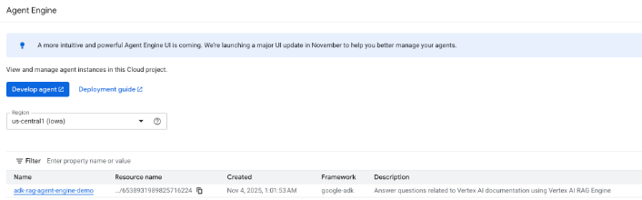

# Documentation Retrieval Agent

## Agent Details

- **Google ADK Version**: `1.18.0`
- **Model**: `gemini-2.5-flash`
- **Tool**: `VertexAiRagRetrieval`
- **Deployment Target**: Vertex AI Agent Engine
- **Capabilities**: Retrieve information from Vertex AI RAG Engine corpus with automatic source attribution

> **Important**: 
> - **Installation** happens at the **parent directory level** (`6_adk_deploy_rag_to_agent_engine/`). See [parent README](../README.md) for installation instructions.
> - **Deployment and testing** happen in **this directory** (`adk_rag_agent_engine_demo/`).

## Overview

This agent is designed to answer questions related to documents you uploaded to Vertex AI RAG Engine. It utilizes Retrieval-Augmented Generation (RAG) with the Vertex AI RAG Engine to fetch relevant documentation snippets and code references, which are then synthesized by an LLM (Gemini) to provide informative answers with citations.


This diagram outlines the agent's workflow, designed to provide informed and context-aware responses. User queries are processed by agent development kit. The LLM determines if external knowledge (RAG corpus) is required. If so, the `VertexAiRagRetrieval` tool fetches relevant information from the configured Vertex RAG Engine corpus. The LLM then synthesizes this retrieved information with its internal knowledge to generate an accurate answer, including citations pointing back to the source documentation URLs.

## Agent Details
| Attribute         | Details                                                                                                                                                                                             |
| :---------------- | :-------------------------------------------------------------------------------------------------------------------------------------------------------------------------------------------------- |
| **Interaction Type** | Conversational                                                                                                                                                                                      |
| **Complexity**    | Intermediate 
| **Agent Type**    | Single Agent                                                                                                                                                                                        |
| **Components**    | Tools, RAG, Evaluation                                                                                                                                                                               |
| **Vertical**      | Horizontal                                                                                                                                                                               |
### Agent Architecture


### Key Features

*   **Retrieval-Augmented Generation (RAG):** Leverages [Vertex AI RAG
    Engine](https://cloud.google.com/vertex-ai/generative-ai/docs/rag-overview)
    to fetch relevant documentation.
*   **Citation Support:** Provides accurate citations for the retrieved content,
    formatted as URLs.
*   **Clear Instructions:** Adheres to strict guidelines for providing factual
    answers and proper citations.

## Project Structure

```
adk_rag_agent_engine_demo/
├── rag/                    # Core application code
│   ├── agent.py            # Main agent logic with VertexAiRagRetrieval
│   ├── agent_engine_app.py # Agent Engine application logic
│   ├── prompts.py          # Agent prompts
│   ├── shared_libraries/   # Shared utilities
│   │   └── prepare_corpus_and_data.py # RAG corpus preparation script
│   └── utils/              # Utility functions and helpers
├── deployment/             # Infrastructure and deployment scripts
│   ├── deploy.py           # Deployment script
│   ├── grant_permissions.sh # Permission setup script
│   ├── run.py              # Testing script for deployed agent
│   └── terraform/          # Terraform infrastructure as code
├── eval/                   # Evaluation framework
│   ├── data/               # Test data and configuration
│   └── test_eval.py        # Evaluation test script
├── notebooks/              # Jupyter notebooks for prototyping and evaluation
├── tests/                  # Unit, integration, and load tests
├── .env.example            # Example environment variables template
├── deployment_metadata.json # Deployment metadata (created/updated after deployment)
├── GEMINI.md               # AI-assisted development guide
├── Makefile                # Makefile for common commands
├── pyproject.toml          # Project dependencies and configuration
├── RAG_architecture.png    # RAG architecture diagram
├── RAG_workflow.png        # RAG workflow diagram
├── README.md               # This file
├── starter_pack_README.md  # Agent Starter Pack README
├── uv.lock                 # Locked dependency versions
└── verify_agent_engin.py   # Agent verification script
```

## Setup and Installation Instructions
### Prerequisites

*   **Google Cloud Account:** You need a Google Cloud account.
*   **Python 3.11+:** Ensure you have Python 3.11 or a later version installed.
*   **uv:** For dependency management and packaging. Please follow the instructions on the official [uv website](https://docs.astral.sh/uv/) for installation.

    ```bash
    curl -LsSf https://astral.sh/uv/install.sh | sh
    ```

*   **Git:** Ensure you have git installed.

### Project Setup

1.  **Navigate to the project directory:**

    ```bash
    cd 6_adk_deploy_rag_to_agent_engine/adk_rag_agent_engine_demo
    ```

2.  **Install Dependencies:**

    Dependencies are installed at the parent directory level. Navigate to `6_adk_deploy_rag_to_agent_engine` and follow the installation instructions in the parent README.

    Alternatively, if installing in this directory:

    ```bash
    uv sync
    ```

    This command reads the `pyproject.toml` file and installs all the necessary dependencies into a virtual environment.

3.  **Set up Environment Variables:**
    Rename the file ".env.example" to ".env" 
    Follow the steps in the file to set up the environment variables.

4. **Setup Corpus:**
    If you have an existing corpus in Vertex AI RAG Engine, please set corpus information in your .env file. For example: RAG_CORPUS='projects/123/locations/us-central1/ragCorpora/456'.

    If you don't have a corpus setup yet, please follow "How to upload my file to my RAG corpus" section. The `prepare_corpus_and_data.py` script will automatically create a corpus (if needed) and update the `RAG_CORPUS` variable in your `.env` file with the resource name of the created or retrieved corpus.

#### How to upload my file to my RAG corpus

The `rag/shared_libraries/prepare_corpus_and_data.py` script helps you set up a RAG corpus and upload an initial document. By default, it downloads Alphabet's 2024 10-K PDF and uploads it to a new corpus.

**Option A: Using UI Console (Recommended for beginners)**

1. Go to [Vertex AI Console](https://console.cloud.google.com/vertex-ai)
2. Navigate to **RAG Engine** in the left menu
3. Click **Create Corpus**
4. Enter a display name and description
5. Select your location (e.g., `us-central1`)
6. Click **Create**
7. Upload documents to your corpus:
   - Click **Import Data**
   - Choose your data source (Cloud Storage, local files, etc.)
   - Upload and wait for indexing to complete
8. Copy the **Corpus ID** from the corpus details page

**RAG Corpus Creation Process:**


> **⚠️ Warning: Billing Charges**
> 
> Creating a RAG corpus automatically provisions a RagManagedDb Spanner instance, which will incur charges. If you're just testing or experimenting, **delete the corpus after you're done** to avoid ongoing charges. You can delete the corpus from the Vertex AI Console or using the `gcloud ai rag-corpora delete` command.

**Option B: Using Script (Automated)**

1.  **Authenticate with your Google Cloud account:**
    ```bash
    gcloud auth application-default login
    ```

2.  **Set up environment variables in your `.env` file:**
    Ensure your `.env` file (copied from `.env.example`) has the following variables set:
    ```
    GOOGLE_CLOUD_PROJECT=your-project-id
    GOOGLE_CLOUD_LOCATION=your-location  # e.g., us-central1
    ```

3.  **Configure and run the preparation script:**

    > **⚠️ Warning: Billing Charges**
    > 
    > Creating a RAG corpus automatically provisions a RagManagedDb Spanner instance, which will incur charges. If you're just testing or experimenting, **delete the corpus after you're done** to avoid ongoing charges.
    *   **To use the default behavior (upload Alphabet's 10K PDF):**
        Simply run the script:
        ```bash
        uv run python rag/shared_libraries/prepare_corpus_and_data.py
        ```
        This will create a corpus named `Alphabet_10K_2024_corpus` (if it doesn't exist) and upload the PDF `goog-10-k-2024.pdf` downloaded from the URL specified in the script.

    *   **To upload a different PDF from a URL:**
        a. Open the `rag/shared_libraries/prepare_corpus_and_data.py` file.
        b. Modify the following variables at the top of the script:
           ```python
           # --- Please fill in your configurations ---
           # ... project and location are read from .env ...
           CORPUS_DISPLAY_NAME = "Your_Corpus_Name"  # Change as needed
           CORPUS_DESCRIPTION = "Description of your corpus" # Change as needed
           PDF_URL = "https://path/to/your/document.pdf"  # URL to YOUR PDF document
           PDF_FILENAME = "your_document.pdf"  # Name for the file in the corpus
           # --- Start of the script ---
           ```
        c. Run the script:
           ```bash
           uv run python rag/shared_libraries/prepare_corpus_and_data.py
           ```

    *   **To upload a local PDF file:**
        a. Open the `rag/shared_libraries/prepare_corpus_and_data.py` file.
        b. Modify the `CORPUS_DISPLAY_NAME` and `CORPUS_DESCRIPTION` variables as needed (see above).
        c. Modify the `main()` function at the bottom of the script to directly call `upload_pdf_to_corpus` with your local file details:
           ```python
           def main():
             initialize_vertex_ai()
             corpus = create_or_get_corpus() # Uses CORPUS_DISPLAY_NAME & CORPUS_DESCRIPTION

             # Upload your local PDF to the corpus
             local_file_path = "/path/to/your/local/file.pdf" # Set the correct path
             display_name = "Your_File_Name.pdf" # Set the desired display name
             description = "Description of your file" # Set the description

             # Ensure the file exists before uploading
             if os.path.exists(local_file_path):
                 upload_pdf_to_corpus(
                     corpus_name=corpus.name,
                     pdf_path=local_file_path,
                     display_name=display_name,
                     description=description
                 )
             else:
                 print(f"Error: Local file not found at {local_file_path}")

             # List all files in the corpus
             list_corpus_files(corpus_name=corpus.name)
           ```
        d. Run the script:
           ```bash
           uv run python rag/shared_libraries/prepare_corpus_and_data.py
           ```

More details about managing data in Vertex RAG Engine can be found in the
[official documentation page](https://cloud.google.com/vertex-ai/generative-ai/docs/rag-quickstart).

## Running the Agent

You can run the agent using the ADK command in your terminal.

**From the parent directory** (`6_adk_deploy_rag_to_agent_engine/`):

1.  Run agent in CLI:

    ```bash
    adk run adk_rag_agent_engine_demo
    ```

2.  Run agent with ADK Web UI:
    ```bash
    adk web
    ```
    Then open the URL shown in the terminal and select the agent from the dropdown.


### Example Interaction
Here's a quick example of how a user might interact with the agent:

**Example 1: Document Information Retrieval**

User: What are the key business segments mentioned in Alphabet's 2024 10-K report?

Agent: According to Alphabet's 2024 10-K report, the key business segments are:
1. Google Services (including Google Search, YouTube, Google Maps, Play Store)
2. Google Cloud (offering cloud computing services, data analytics, and AI solutions)
3. Other Bets (including Waymo for autonomous driving technology)
[Source: goog-10-k-2024.pdf]

## Evaluating the Agent

The evaluation can be run from the `RAG` directory using
the `pytest` module:

```bash
uv sync --dev
uv run pytest eval
```

### Evaluation Process

The evaluation framework consists of three key components:

1. **test_eval.py**: The main test script that orchestrates the evaluation process. It uses the `AgentEvaluator` from Google ADK to run the agent against a test dataset and assess its performance based on predefined criteria.

2. **conversation.test.json**: Contains a sequence of test cases structured as a conversation. Each test case includes:
   - A user query (e.g., questions about Alphabet's 10-K report)
   - Expected tool usage (which tools the agent should call and with what parameters)
   - Reference answers (ideal responses the agent should provide)

3. **test_config.json**: Defines evaluation criteria and thresholds:
   - `tool_trajectory_avg_score`: Measures how well the agent uses the appropriate tools
   - `response_match_score`: Measures how closely the agent's responses match the reference answers

When you run the evaluation, the system:
1. Loads the test cases from conversation.test.json
2. Sends each query to the agent
3. Compares the agent's tool usage against expected tool usage
4. Compares the agent's responses against reference answers
5. Calculates scores based on the criteria in test_config.json

This evaluation helps ensure the agent correctly leverages the RAG capabilities to retrieve relevant information and generates accurate responses with proper citations.

## Deploying the Agent

The Agent can be deployed to Vertex AI Agent Engine using the following
commands:

```bash
uv run python deployment/deploy.py
```

Or using the Makefile:

```bash
make deploy
```

**Deployment Process:**

The deployment process involves several steps:

1. **Exporting Dependencies**: The system exports all required Python packages to a `requirements.txt` file
2. **Staging to Cloud Storage**: Agent code, dependencies, and configuration are uploaded to a GCS bucket
3. **Creating Agent Engine**: Vertex AI Agent Engine creates the reasoning engine with the uploaded artifacts
4. **Metadata Update**: The `deployment_metadata.json` file is automatically updated with the Agent Engine ID

**Example Deployment Output:**



After deploying the agent, you'll see output similar to:

```
INFO: Creating new agent: `adk-rag-agent-engine-demo`
INFO: Agent Engine created.
Agent Engine ID written to `deployment_metadata.json`
✔ Deployment successful! Test your agent: `notebooks/adk_app_testing.ipynb`
```

The deployment will provide:
- **Agent Engine ID**: Full resource name (e.g., `projects/PROJECT_NUMBER/locations/us-central1/reasoningEngines/AGENT_ENGINE_ID`)
- **Service Account**: The service account used for the deployment (e.g., `service-PROJECT_NUMBER@gcp-sa-aiplatform-re.iam.gserviceaccount.com`)
- **Console Link**: Direct link to view the deployed agent in Google Cloud Console
- **Logs Link**: Link to view deployment logs in Cloud Logging

Please note your Agent Engine resource name and update `.env` file accordingly as this is crucial for testing the remote agent.

You may also modify the deployment script for your use cases.

## Testing the deployed agent

After deploying the agent, follow these steps to test it:

### Option 1: Using Google Cloud Console (Interactive UI)

1. **Access the Agent Engine Console:**
   - After deployment, you'll receive a console link in the deployment output
   - Or navigate to: [Vertex AI Agent Engine Console](https://console.cloud.google.com/vertex-ai/agents)
   - Select your region (e.g., `us-central1`)
   - Find your agent in the list (e.g., `adk-rag-agent-engine-demo`)

2. **Test Your Agent:**
   - Click on your agent to open the Agent Engine UI
   - Use the interactive interface to send queries to your agent
   - View detailed responses, confidence scores, token usage, and citations

**Example Agent Engine UI:**


The Agent Engine UI provides:
- **Interactive Query Interface**: Send questions directly to your deployed agent
- **Detailed Response Analysis**: View confidence scores, token usage, and log probabilities
- **Citation Tracking**: See which documents from your RAG corpus were used
- **Performance Metrics**: Monitor response quality and agent behavior

### Option 2: Programmatic Testing

1. **Update Environment Variables:**
   - Open your `.env` file.
   - The `AGENT_ENGINE_ID` should have been automatically updated by the `deployment/deploy.py` script when you deployed the agent. Verify that it is set correctly:
     ```
     AGENT_ENGINE_ID=projects/<PROJECT_NUMBER>/locations/us-central1/reasoningEngines/<AGENT_ENGINE_ID>
     ```

2. **Grant RAG Corpus Access Permissions:**

   Before testing your deployed agent, you need to grant the Agent Engine service account permission to query your RAG corpus.

   **Option A: Using the Automated Script (Recommended)**

   - Ensure your `.env` file has the following variables set correctly:
     ```
     GOOGLE_CLOUD_PROJECT=your-project-id
     RAG_CORPUS=projects/<project-number>/locations/us-central1/ragCorpora/<corpus-id>
     ```
   - Run the permissions script:
     ```bash
     chmod +x deployment/grant_permissions.sh
     ./deployment/grant_permissions.sh
     ```
   This script will:
   - Read the environment variables from your `.env` file
   - Create a custom role with RAG Corpus query permissions
   - Grant the necessary permissions to the AI Platform Reasoning Engine Service Agent

   **Option B: Manual Setup Using gcloud Commands**

   If you prefer to set up permissions manually, use the following commands:

   ```bash
   ## Setting Up Permissions

   ### Step 1: Create Custom IAM Role
   gcloud iam roles create ragCorpusQueryRole \
       --project=your-project-id \
       --title="RAG Corpus Query Role" \
       --permissions="aiplatform.ragCorpora.query"

   ### Step 2: Grant Role to Service Account
   PROJECT_NUMBER=$(gcloud projects describe your-project-id --format="value(projectNumber)")
   gcloud projects add-iam-policy-binding your-project-id \
       --member="serviceAccount:service-${PROJECT_NUMBER}@gcp-sa-aiplatform-re.iam.gserviceaccount.com" \
       --role="projects/your-project-id/roles/ragCorpusQueryRole"
   ```

   Replace `your-project-id` with your actual Google Cloud project ID.

3. **Test the Remote Agent:**
   - Run the test script:
     ```bash
     uv run python deployment/run.py
     ```
   This script will:
   - Connect to your deployed agent
   - Send a series of test queries
   - Display the agent's responses with proper formatting

   The test script includes example queries about Alphabet's 10-K report. You can modify the queries in `deployment/run.py` to test different aspects of your deployed agent.

### Option 3: Using Jupyter Notebook

You can also test your deployed agent using the provided Jupyter notebook:

```bash
jupyter notebook notebooks/adk_app_testing.ipynb
```

The notebook provides:
- Loading the deployed agent using the Agent Engine ID from `deployment_metadata.json`
- Testing with streaming queries
- Comparing local vs. remote agent behavior
- Error handling and debugging examples

### Alternative: Using Agent Starter Pack

You can also use the [Agent Starter Pack](https://goo.gle/agent-starter-pack) to create a production-ready version of this agent with additional deployment options:

```bash
# Create and activate a virtual environment
python -m venv .venv && source .venv/bin/activate # On Windows: .venv\Scripts\activate

# Install the starter pack and create your project
pip install --upgrade agent-starter-pack
agent-starter-pack create my-rag-agent -a adk@rag
```

<details>
<summary>⚡️ Alternative: Using uv</summary>

If you have [`uv`](https://github.com/astral-sh/uv) installed, you can create and set up your project with a single command:
```bash
uvx agent-starter-pack create my-rag-agent -a adk@rag
```
This command handles creating the project without needing to pre-install the package into a virtual environment.

</details>

The starter pack will prompt you to select deployment options and provides additional production-ready features including automated CI/CD deployment scripts.

## Customization

### Customize Agent
You can customize system instruction for the agent and add more tools to suit your need, for example, google search.

### Customize Vertex RAG Engine
You can read more about [official Vertex RAG Engine documentation](https://cloud.google.com/vertex-ai/generative-ai/docs/rag-quickstart) for more details on customizing corpora and data.


### Plug-in other retrieval sources
You can also integrate your preferred retrieval sources to enhance the agent's
capabilities. For instance, you can seamlessly replace or augment the existing
`VertexAiRagRetrieval` tool with a tool that utilizes Vertex AI Search or any
other retrieval mechanism. This flexibility allows you to tailor the agent to
your specific data sources and retrieval requirements.


## Troubleshooting

### Quota Exceeded Errors

When running the `prepare_corpus_and_data.py` script, you may encounter an error related to API quotas, such as:

```
Error uploading file ...: 429 Quota exceeded for aiplatform.googleapis.com/online_prediction_requests_per_base_model with base model: textembedding-gecko.
```

This is especially common for new Google Cloud projects that have lower default quotas.

**Solution:**

You will need to request a quota increase for the model you are using.

1.  Navigate to the **Quotas** page in the Google Cloud Console: [https://console.cloud.google.com/iam-admin/quotas](https://console.cloud.google.com/iam-admin/quotas)
2.  Follow the instructions in the official documentation to request a quota increase: [https://cloud.google.com/vertex-ai/docs/quotas#request_a_quota_increase](https://cloud.google.com/vertex-ai/docs/quotas#request_a_quota_increase)


## Disclaimer

This agent sample is provided for illustrative purposes only and is not intended for production use. It serves as a basic example of an agent and a foundational starting point for individuals or teams to develop their own agents.

This sample has not been rigorously tested, may contain bugs or limitations, and does not include features or optimizations typically required for a production environment (e.g., robust error handling, security measures, scalability, performance considerations, comprehensive logging, or advanced configuration options).

Users are solely responsible for any further development, testing, security hardening, and deployment of agents based on this sample. We recommend thorough review, testing, and the implementation of appropriate safeguards before using any derived agent in a live or critical system.