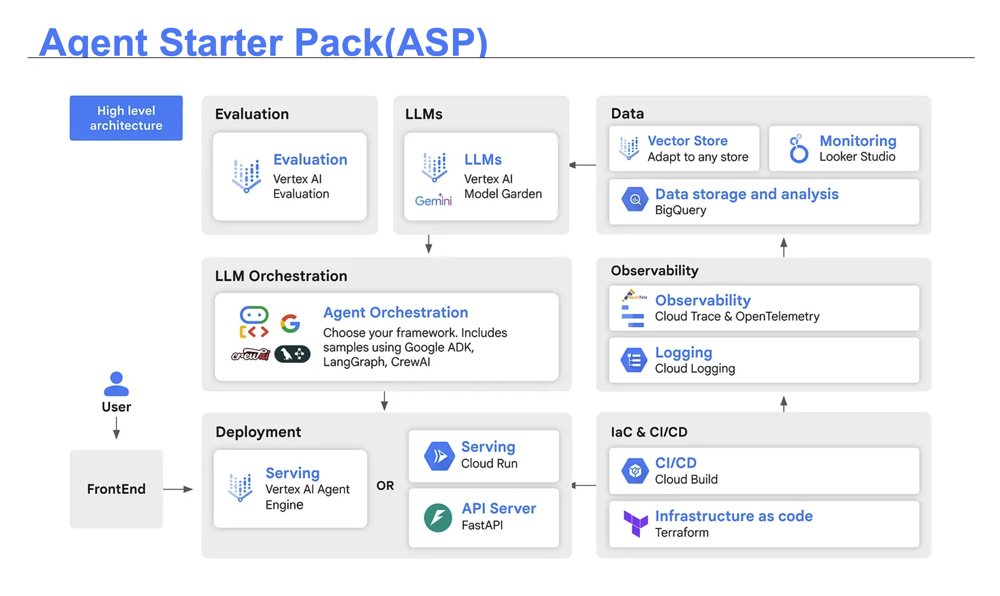
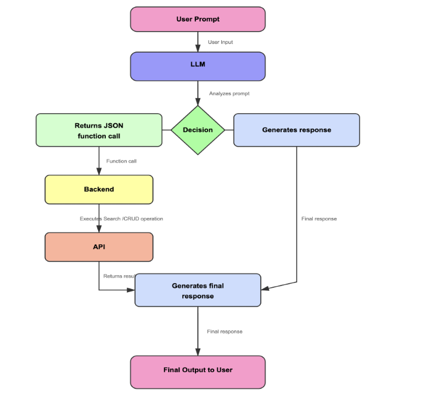
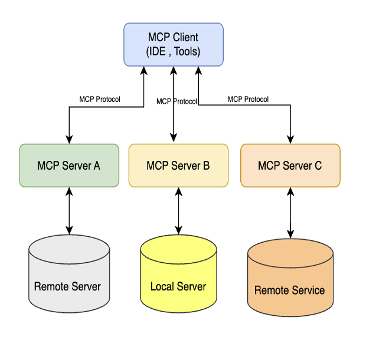
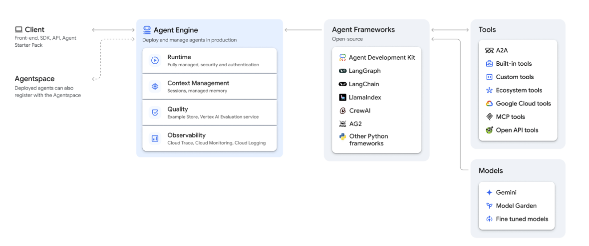
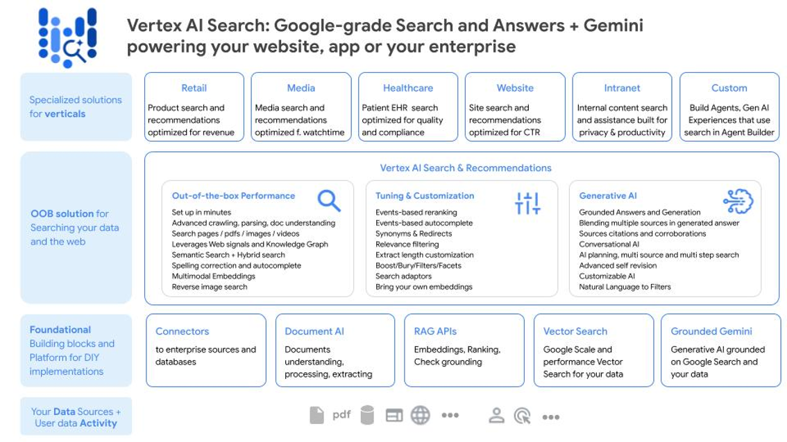

# ADK Advanced

> **A comprehensive collection of Google Agent Development Kit (Google ADK) implementations**  
> Demonstrating advanced capabilities, deployment strategies, and production-ready use cases for building intelligent AI agents.

[](https://github.com/arjunprabhulal/adk-advanced)

---

## Table of Contents

- [Repository Structure](#repository-structure)
- [Getting Started](#getting-started)
  - [Prerequisites](#prerequisites)
  - [Installation](#installation)
  - [Environment Variables Configuration](#environment-variables-configuration)
  - [Vertex AI Agent Engine Capabilities](#vertex-ai-agent-engine-capabilities)
  - [Agent Starter Pack (ASP)](#agent-starter-pack-asp)
- [Implementations](#implementations)
  - [Core Capabilities](#core-capabilities)
    - [1. Tools](#1-tools)
    - [2. Model Context Protocol](#2-model-context-protocol)
  - [Deployment Implementations](#deployment-implementations)
    - [3. Agent Engine Deployment](#3-agent-engine-deployment)
    - [4. Cloud Run Deployment](#4-cloud-run-deployment)
    - [5. GKE Deployment](#5-gke-deployment)
  - [Agent Starter Pack - Remote Template (RAG - Production-ready)](#agent-starter-pack---remote-template-rag---production-ready)
    - [6. RAG Agent Remote Template](#6-rag-agent-remote-template)
  - [Vertex AI Search (Simple)](#vertex-ai-search-simple)
    - [7. Vertex Search Agent](#7-vertex-search-agent)
  - [Vertex AI RAG Engine (Simple)](#vertex-ai-rag-engine-simple)
    - [8. Vertex AI RAG Engine Agent](#8-vertex-ai-rag-engine-agent)
- [Quick Start](#quick-start)
- [References](#references)
- [Repository](#repository)
- [Contributing](#contributing)
- [License](#license)

---

## Repository Structure

### Directory Overview

| # | Directory | Description | Subdirectories |
|---|-----------|-------------|----------------|
| 1 | [adk_tools/](1_adk_tools/) | Tool implementations | [adk_builtin_tool_agent/](1_adk_tools/adk_builtin_tool_agent/)<br>[adk_custom_tool_agent/](1_adk_tools/adk_custom_tool_agent/) |
| 2 | [adk_mcp/](2_adk_mcp/) | Model Context Protocol implementations | [adk_mcp_github_agent/](2_adk_mcp/adk_mcp_github_agent/)<br>[adk_mcp_firecrawl_agent/](2_adk_mcp/adk_mcp_firecrawl_agent/) |
| 3 | [adk_deploy_agent_engine/](3_adk_deploy_agent_engine/) | Agent Engine deployment | [adk_agent_agentengine_demo/](3_adk_deploy_agent_engine/adk_agent_agentengine_demo/) |
| 4 | [adk_deploy_cloudrun/](4_adk_deploy_cloudrun/) | Cloud Run deployment | [adk_agent_cloudrun_demo/](4_adk_deploy_cloudrun/adk_agent_cloudrun_demo/) |
| 5 | [adk_deploy_gke/](5_adk_deploy_gke/) | GKE deployment | [adk_agent_gke_demo/](5_adk_deploy_gke/adk_agent_gke_demo/) |
| 6 | [adk_deploy_rag_to_agent_engine/](6_adk_deploy_rag_to_agent_engine/) | Agent Starter Pack - Remote Template (RAG - Production-ready) | [adk_rag_agent_engine_demo/](6_adk_deploy_rag_to_agent_engine/adk_rag_agent_engine_demo/) |
| 7 | [adk_vertex_ai_search_simple/](7_adk_vertex_ai_search_simple/) | Vertex AI Search | [vertex_search_agent/](7_adk_vertex_ai_search_simple/vertex_search_agent/) |
| 8 | [adk_vertex_ai_ragengine_simple/](8_adk_vertex_ai_ragengine_simple/) | Vertex AI RAG Engine | [adk_rag_agent/](8_adk_vertex_ai_ragengine_simple/adk_rag_agent/) |

## Getting Started

Each directory contains **self-contained Google ADK agent implementations**. Navigate to any subdirectory and follow its README for specific instructions.

---

### Prerequisites

Before you begin, ensure you have the following:

- **Python** `3.11` or later
- **pip** or **uv** package manager for installing packages
- **Google API key** from [Google AI Studio](https://aistudio.google.com/apikey) (for local development)
- **Google Cloud Project** (for deployment scenarios)

### Installation

Install the Google Agent Development Kit using either `pip` or `uv`:

**Using pip:**
```bash
pip install google-adk
```

**Using uv (recommended for faster installs):**
```bash
# Install uv if not already installed
curl -LsSf https://astral.sh/uv/install.sh | sh

# Install google-adk
uv pip install google-adk
```

> **Tip**: Consider using a virtual environment to isolate dependencies:
> ```bash
> # Using venv + pip
> python -m venv venv
> source venv/bin/activate  # On Windows: venv\Scripts\activate
> pip install google-adk
> 
> # Or using uv (automatically manages virtual environments)
> uv venv
> source .venv/bin/activate  # On Windows: .venv\Scripts\activate
> uv pip install google-adk
> ```

### Environment Variables Configuration

The `GOOGLE_GENAI_USE_VERTEXAI` environment variable determines which API backend your application uses:

#### Using `GOOGLE_GENAI_USE_VERTEXAI=False` (Local Development)

Set this to `False` (or leave it unset) when:

- **Developing locally** for rapid prototyping using the Gemini Developer API
- **Authenticating with an API Key** from [Google AI Studio](https://aistudio.google.com/apikey)
- **Not needing enterprise features** and preferring simpler setup

**Configuration:**
```bash
GOOGLE_GENAI_USE_VERTEXAI=False
GOOGLE_API_KEY="your-api-key"
```

#### Using `GOOGLE_GENAI_USE_VERTEXAI=True` (Deployment)

Set this to `True` when:

- **Deploying on Google Cloud** platforms (Cloud Run, Agent Engine, or GKE)
- **Using Application Default Credentials (ADC)** for authentication (standard for code running within Google Cloud)
- **Needing Vertex AI features**:
  - Managed sessions via `VertexAiSessionService`
  - Grounding with Vertex AI Search or proprietary data
  - Integrated security, data privacy, and data sovereignty controls
  - Cloud Trace for observability and performance monitoring
  - **Using Vertex AI Express Mode** (requires this variable plus an API key) [Experimental Preview mode not GA]

**Configuration:**
```bash
GOOGLE_GENAI_USE_VERTEXAI=True
GOOGLE_CLOUD_PROJECT="your-project-id"
GOOGLE_CLOUD_LOCATION="us-central1"
```

> **Note**: When using `GOOGLE_GENAI_USE_VERTEXAI=True`, the application authenticates using the service account attached to the Cloud Run service or GKE pod via Application Default Credentials. No explicit API keys are needed in your code or environment variables.

### Vertex AI Agent Engine Capabilities

Vertex AI Agent Engine provides a robust, managed platform designed for deploying, running, and scaling AI agents with enterprise-grade features.

- **Managed runtime for agents**: Agent Engine automatically handles deployment, scaling, containerization, and infrastructure security, allowing developers to focus on agent logic.
- **Sessions & memory bank**: Features built-in session management to retain context across interactions, and a persistent memory layer for long-term agent state, crucial for conversational AI.
- **Tool & model Integration**: Enables seamless connection of Large Language Models (LLMs) with various tools, such as APIs or custom function calls, facilitating the creation of complex, end-to-end agent workflows with minimal code.
- **Security, compliance, observability**: Offers enterprise-grade controls including VPC Service Controls (VPC-SC), private networking, comprehensive audit logging, and tracing dashboards for safe, compliant, and transparent operations.

### Agent Starter Pack (ASP)

The **Agent Starter Pack (ASP)** bridges the gap between AI agent experimentation and production. It provides a collection of production-ready GenAI Agent Templates built for Google Cloud, designed to accelerate development through pre-built templates and robust infrastructure for deployment, observability, and CI/CD.

**Core Purpose**: ASP enables rapid generation of generative-AI agents on Google Cloud by providing deployment infrastructure, observability/monitoring scaffolding, CI/CD pipelines, and best-practice project scaffolding.

#### ASP Architecture

The following diagram illustrates the high-level architecture of the Agent Starter Pack, showing how components interact from user interaction through deployment and observability:



**Key Components:**

- **User & Frontend**: User interactions through frontend applications
- **LLMs**: Large Language Models from Vertex AI Model Garden and Gemini
- **LLM Orchestration**: Framework selection (Google ADK, LangGraph, CrewAI) for agent orchestration
- **Deployment Options**: 
  - Vertex AI Agent Engine (managed serving)
  - Cloud Run (containerized services)
  - FastAPI (API server)
- **IaC & CI/CD**: Infrastructure as Code (Terraform) and CI/CD pipelines (Cloud Build)
- **Observability**: Cloud Trace, OpenTelemetry, and Cloud Logging for monitoring
- **Data**: Vector stores, BigQuery for data storage, and Looker Studio for monitoring dashboards
- **Evaluation**: Vertex AI Evaluation for assessing agent performance

#### ASP Features

- **Production-ready foundation**: ASP provides templates for deployment, CI/CD pipelines, infrastructure as code (IaC), API serving, and testing.
- **Observability & monitoring built in**: Includes logging, tracing, and dashboards for comprehensive monitoring of agent performance.
- **Security & compliance scaffolding**: Offers Google Cloud Platform (GCP) best practices for security controls, ensuring enterprise-grade security.
- **Data, UI & storage integrations**: Supports connectivity for data sources, vector stores for RAG, UI playgrounds, and storage layers.
- **Focus on core logic**: ASP allows developers to focus on prompts, tools, orchestration, and business logic while the infrastructure is handled automatically.

#### ASP Usage

The Agent Starter Pack is used in deployment implementations (folders 3, 4, and 5) to:

- **Prototype to Production**: Accelerate deployment of Google ADK or LangChain agents using ready-made templates.
- **Enterprise Deployment**: Deploy agents with built-in security, monitoring, scalability, and CI/CD pipelines.
- **Multi-Agent / RAG Workflows**: Enable tools, retrieval, and orchestration with data-store & UI support.
- **Cross-Team Collaboration**: Separate agent logic from infrastructure so development and operations teams can work in parallel.

**Available Templates:**

| Agent Name | Description | Use Case |
|------------|-------------|----------|
| `adk_base` | Base ReAct agent using Google's [Agent Development Kit](https://github.com/google/adk-python) | General purpose conversational agent |
| `adk_a2a_base` | ADK agent with [Agent2Agent (A2A) Protocol](https://a2a-protocol.org/) support | Distributed agent communication and interoperability |
| `agentic_rag` | RAG agent with production-ready data ingestion pipeline | Document search and question answering |
| `langgraph_base_react` | Base ReAct agent using LangGraph | Graph-based conversational agent |
| `crewai_coding_crew` | Multi-agent system implemented with CrewAI | Collaborative coding assistance |
| `adk_live` | Real-time multimodal RAG agent with Gemini Live API | Audio/video/text chat with knowledge base |

For detailed template information, see the [Agent Templates Overview](https://googlecloudplatform.github.io/agent-starter-pack/agents/overview.html).

**Quick Start:**
```bash
# Install uv (if not already installed)
curl -LsSf https://astral.sh/uv/install.sh | sh

# Create a new agent project (interactive CLI)
uvx agent-starter-pack create my-awesome-agent

# Navigate to project and get started
cd my-awesome-agent
make install && make playground
```

> **Note**: The directory name will match the project name you provide in the `create` command. For example, `uvx agent-starter-pack create adk_agent_agentengine_demo` creates a directory named `adk_agent_agentengine_demo`.

**Deployment Targets:**
- **Agent Engine** (folder 3): Deploy to Vertex AI Agent Engine
- **Cloud Run** (folder 4): Deploy as containerized services
- **GKE** (folder 5): Deploy to Google Kubernetes Engine

For more information, see the [Agent Starter Pack Documentation](https://googlecloudplatform.github.io/agent-starter-pack/) and [GitHub Repository](https://github.com/GoogleCloudPlatform/agent-starter-pack).

---

## Implementations

### Core Capabilities

These implementations demonstrate fundamental Google ADK capabilities including built-in tools, custom function tools, and Model Context Protocol (MCP) integrations.

#### 1. Tools

Implementations demonstrating different types of tools available in Google ADK.



| Implementation | Directory | Description |
|---------------|-----------|-------------|
| **Built-in Tools** | [adk_builtin_tool_agent/](1_adk_tools/adk_builtin_tool_agent/) | Using Google ADK's built-in tools like `google_search` |
| **Function Tools** | [adk_custom_tool_agent/](1_adk_tools/adk_custom_tool_agent/) | Creating custom tools using `FunctionTool` |

---

#### 2. Model Context Protocol

Implementations using Model Context Protocol (MCP) to connect to external services and tools.



| Implementation | Directory | Description |
|---------------|-----------|-------------|
| **GitHub MCP** | [adk_mcp_github_agent/](2_adk_mcp/adk_mcp_github_agent/) | Access GitHub via MCP toolset |
| **Firecrawl MCP** | [adk_mcp_firecrawl_agent/](2_adk_mcp/adk_mcp_firecrawl_agent/) | Web scraping via Firecrawl MCP client |

---

### Deployment Implementations

These implementations demonstrate production-ready deployment patterns using **Agent Starter Pack (ASP)** with full infrastructure, CI/CD pipelines, and testing frameworks.

#### 3. Agent Engine Deployment

Complete implementation for deploying and managing agents on Vertex AI Agent Engine using **Agent Starter Pack (ASP)**.



| Implementation | Directory | Description |
|---------------|-----------|-------------|
| **Agent Engine** | [adk_agent_agentengine_demo/](3_adk_deploy_agent_engine/adk_agent_agentengine_demo/) | Deploy agent to Vertex AI Agent Engine using ASP templates |

> **Note**: 
> - This implementation uses Agent Starter Pack to generate production-ready boilerplate with Terraform infrastructure, CI/CD pipelines, and testing frameworks.
> - **Installation** happens at the parent directory level (`3_adk_deploy_agent_engine/`).
> - **Deployment** happens from the child directory (`adk_agent_agentengine_demo/`).
> - **Testing**: After deployment, use `jupyter notebook notebooks/adk_app_testing.ipynb` to validate your deployed agent.
> - See [3_adk_deploy_agent_engine/README.md](3_adk_deploy_agent_engine/README.md) for detailed workflow instructions.

---

#### 4. Cloud Run Deployment

Complete implementation for deploying agents as containerized services on Google Cloud Run using **Agent Starter Pack (ASP)**.

| Implementation | Directory | Description |
|---------------|-----------|-------------|
| **Cloud Run** | [adk_agent_cloudrun_demo/](4_adk_deploy_cloudrun/adk_agent_cloudrun_demo/) | Deploy agent to Google Cloud Run using ASP templates |

> **Note**: This implementation uses Agent Starter Pack to generate production-ready boilerplate with Docker containerization, Cloud Run deployment, and CI/CD workflows.

---

#### 5. GKE Deployment

Complete implementation for deploying agents on Google Kubernetes Engine (GKE) for enterprise-scale deployments.

| Implementation | Directory | Description |
|---------------|-----------|-------------|
| **GKE** | [adk_agent_gke_demo/](5_adk_deploy_gke/adk_agent_gke_demo/) | Deploy agent to Google Kubernetes Engine with Workload Identity configuration |

---

## Agent Starter Pack - Remote Template (RAG - Production-ready)

Remote templates allow you to create production-ready AI agents from Git repositories using Agent Starter Pack. Any Git repository can be used as a template - the system automatically handles fetching, configuration, and generating your complete agent project.

### 6. RAG Agent Remote Template

A complete RAG (Retrieval-Augmented Generation) agent template that can be used as a remote template with Agent Starter Pack. This template demonstrates how to create a production-ready RAG agent using Vertex AI RAG Engine, deployed to Agent Engine. Includes full deployment infrastructure, Terraform configuration, CI/CD pipelines, and testing frameworks.


| Implementation | Directory | Description |
|---------------|-----------|-------------|
| **RAG Agent Remote Template** | [adk_rag_agent_engine_demo/](6_adk_deploy_rag_to_agent_engine/adk_rag_agent_engine_demo/) | Remote template for creating RAG agents using Vertex AI RAG Engine, deployable to Agent Engine |

**Using this template:**

```bash
# Use this repository as a remote template
uvx agent-starter-pack create my-rag-agent -a https://github.com/arjunprabhulal/adk-advanced/tree/main/6_adk_deploy_rag_to_agent_engine/adk_rag_agent_engine_demo
```

> **Note**: This template is configured with `[tool.agent-starter-pack]` in `pyproject.toml`, making it discoverable and usable as a remote template. See [Using Remote Templates](https://googlecloudplatform.github.io/agent-starter-pack/remote-templates/using-remote-templates.html) for more information.

---

### Vertex AI Search (Simple)

Simple agent implementations using Vertex AI Search for intelligent document search and retrieval. Perfect for local development and testing without deployment complexity.



#### 7. Vertex Search Agent

Simple agent implementation using Vertex AI Search for intelligent document search and retrieval.

| Implementation | Directory | Description |
|---------------|-----------|-------------|
| **Vertex AI Search Agent** | [vertex_search_agent/](7_adk_vertex_ai_search_simple/vertex_search_agent/) | Simple agent using Vertex AI Search for local testing |

---

### Vertex AI RAG Engine (Simple)

Simple agent implementations using Vertex AI RAG Engine for enhanced context-aware responses. Perfect for local development and testing without deployment complexity.


#### 8. Vertex AI RAG Engine Agent

Simple agent implementation using Vertex AI RAG Engine for enhanced context-aware responses.

| Implementation | Directory | Description |
|---------------|-----------|-------------|
| **Vertex AI RAG Engine Agent** | [adk_rag_agent/](8_adk_vertex_ai_ragengine_simple/adk_rag_agent/) | Simple RAG agent using Vertex AI RAG Engine for local testing |

---

## Quick Start

Follow these steps to get started with any implementation:

1. **Choose an implementation** from the directories above
2. **Navigate** to the appropriate directory:
   - For **folders 1-2** (Core Capabilities): Navigate to the parent directory (e.g., `1_adk_tools/`) for installation
   - For **folders 3-5** (Deployment Implementations): Follow the parent directory README for installation, then navigate to the child directory for deployment
   - For **folder 7** (Vertex AI Search - Simple): Follow the parent directory README for installation and local setup
   - For **folder 8** (Vertex AI RAG Engine - Simple): Follow the parent directory README for installation and local setup
   - For **folder 6** (Agent Starter Pack - Remote Template): This is a production-ready RAG remote template that can be used with Agent Starter Pack CLI. See the parent directory README for details on using it as a template
3. **Read** the `README.md` in that directory for specific instructions
4. **Set up** your `.env` file:
   - For **local development**: Copy `.env.example` to `.env` and set `GOOGLE_GENAI_USE_VERTEXAI=False` with your `GOOGLE_API_KEY`
   - For **deployment**: Set `GOOGLE_GENAI_USE_VERTEXAI=True` with `GOOGLE_CLOUD_PROJECT` and `GOOGLE_CLOUD_LOCATION`
5. **Run** with `adk run <agent-name>` or `adk web` (agent selection happens in the browser)

> **Note**: Demo screenshots are available in the root `images/` folder. Check the individual README files for visual demonstrations of each agent's capabilities.

### Example Workflow

**For Tools and MCP implementations (folders 1-2):**

```bash
# Navigate to parent directory
cd 1_adk_tools

# Install dependencies (at parent level)
uv pip install -r requirements.txt
# or: pip install -r requirements.txt

# Navigate to specific agent
cd adk_builtin_tool_agent

# Set up environment variables
cp .env.example .env
# Edit .env with your API keys

# Run from parent directory
cd ..
adk web  # Agent selection happens in browser
```

**For Deployment implementations (folders 3-5):**

```bash
# Navigate to parent directory
cd 3_adk_deploy_agent_engine

# Install dependencies (at parent level)
uv pip install -r requirements.txt

# Navigate to agent project
cd adk_agent_agentengine_demo

# Set up environment variables
cp .env.example .env
# Edit .env with your configuration

# Deploy (from agent directory)
make setup-dev-env
make deploy

# Test your deployed agent using Jupyter notebook
jupyter notebook notebooks/adk_app_testing.ipynb
```

> **Note**: After successful deployment, the `deployment_metadata.json` file is automatically updated with your Agent Engine ID. Use the provided Jupyter notebook (`notebooks/adk_app_testing.ipynb`) to validate and test your deployed agent programmatically.

---

## References

| Resource | Description |
|----------|-------------|
| [Google ADK Documentation](https://google.github.io/adk-docs/) | Complete Google ADK documentation and guides |
| [Python Quickstart](https://google.github.io/adk-docs/get-started/python/) | Get started with Google ADK in Python |
| [Tools Documentation](https://google.github.io/adk-docs/tools/) | Learn about Google ADK tools and capabilities |
| [MCP Tools](https://google.github.io/adk-docs/tools/mcp-tools/) | Model Context Protocol integration guide |
| [Google ADK Deployment](https://google.github.io/adk-docs/deploy/) | Overview of deployment options for Google ADK agents |
| &nbsp;&nbsp;└─ [Agent Engine](https://google.github.io/adk-docs/deploy/agent-engine/) | Deploy agents to Vertex AI Agent Engine |
| &nbsp;&nbsp;└─ [Cloud Run](https://google.github.io/adk-docs/deploy/cloud-run/) | Deploy agents to Google Cloud Run |
| &nbsp;&nbsp;└─ [GKE](https://google.github.io/adk-docs/deploy/gke/) | Deploy agents to Google Kubernetes Engine |
| [Vertex AI Agent Engine](https://docs.cloud.google.com/agent-builder/agent-engine/overview) | Vertex AI Agent Engine overview and documentation |
| [Vertex AI RAG Engine](https://docs.cloud.google.com/vertex-ai/generative-ai/docs/rag-engine/rag-overview) | Vertex AI RAG Engine overview and documentation |
| [Vertex AI Search](https://docs.cloud.google.com/generative-ai-app-builder/docs/introduction) | Vertex AI Search (formerly Enterprise Search) overview and documentation |
| [Agent Starter Pack](https://googlecloudplatform.github.io/agent-starter-pack/) | Agent Starter Pack documentation and guides |
| [Agent Templates Overview](https://googlecloudplatform.github.io/agent-starter-pack/agents/overview.html) | Detailed information about available agent templates |
| [Remote Templates](https://googlecloudplatform.github.io/agent-starter-pack/remote-templates/using-remote-templates.html) | Guide to using Git repositories as remote templates |
| [Agent Starter Pack GitHub](https://github.com/GoogleCloudPlatform/agent-starter-pack) | Agent Starter Pack source code and repository |

---

## Repository

This repository contains advanced implementations and examples for the **Google Agent Development Kit (Google ADK)**.

**GitHub Repository**: [arjunprabhulal/adk-advanced](https://github.com/arjunprabhulal/adk-advanced)

### What's Included

This workshop repository demonstrates:

- **Function Tools**: Custom tool implementations using Google ADK
- **MCP Integration**: Model Context Protocol (MCP) toolsets and servers
- **Vertex AI Agent Engine**: Deployment patterns and configurations
- **Vertex AI RAG Engine**: Retrieval-Augmented Generation implementations
- **Vertex AI Search**: Enterprise search integration examples
- **Agent Starter Pack (ASP)**: Production-ready templates for Agent Engine, Cloud Run, and GKE deployments with built-in CI/CD, observability, and security
- **Demo Images**: Visual demonstrations in root `images/` folder showing example agent interactions

---

## Contributing

Contributions, issues, and feature requests are welcome! 

If you'd like to contribute:

1. Fork the repository
2. Create a feature branch 
3. Commit your changes 
4. Push to the branch 
5. Open a Pull Request

Please ensure your code follows the existing style and includes appropriate documentation.

---

## License

This project is part of the **Google Agent Development Kit (ADK)** advanced implementations.

The code examples and implementations in this repository are provided as-is for educational and demonstration purposes.

---

<div align="center">

[Back to Top](#adk-advanced)

</div>

